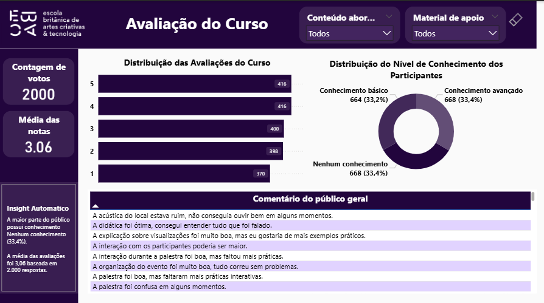
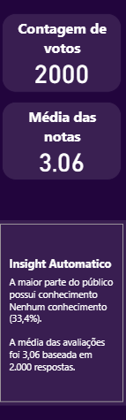
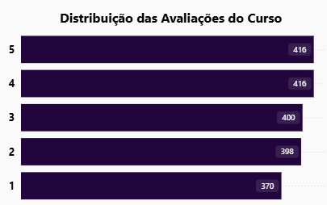
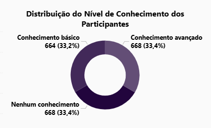
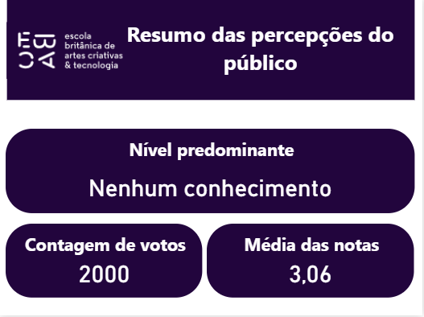

# 📊 Dashboard de Avaliação de Curso (Power BI)

## 📌 Visão Geral do Projeto

Este projeto apresenta um **dashboard interativo desenvolvido em Power BI** para análise de avaliações de um curso.

O objetivo da análise é compreender:

- O **perfil de conhecimento dos participantes**
- A **distribuição das avaliações**
- Os **principais fatores que influenciam notas mais altas**

O dashboard foi desenvolvido aplicando boas práticas de **visualização de dados, modelagem e storytelling analítico**, permitindo identificar rapidamente padrões e insights relevantes.

---

# 🔎 Dashboard Interativo

Você pode visualizar o dashboard interativo abaixo:

<iframe title="Avaliação Curso" width="600" height="373.5" src="https://app.powerbi.com/view?r=eyJrIjoiMmU1ODYwY2EtMWMxNy00NzcwLWFmMzYtNmJmYWU1OWQ4Y2QwIiwidCI6IjE0Y2JkNWE3LWVjOTQtNDZiYS1iMzE0LWNjMGZjOTcyYTE2MSIsImMiOjh9" frameborder="0" allowFullScreen="true"></iframe>

---

# 📸 Prévia do Dashboard

### Visão Geral


### Análise de Principais Influenciadores


### Indicadores (KPIs)


### Distribuição das Avaliações


### Nível de Conhecimento dos Participantes


###Tooltip


---

# 💡 Principais Insights

A análise dos dados revelou alguns pontos importantes:

- A **maior parte dos participantes possui nível de conhecimento intermediário**
- A **média geral das avaliações foi 3,06**, indicando percepção moderadamente positiva do curso
- Aspectos como **didática e clareza** foram frequentemente citados como pontos positivos
- Entre as críticas mais comuns estão **falta de exemplos práticos e pouca interação durante as aulas**
- A análise de **principais influenciadores** ajuda a identificar quais fatores estão mais associados a avaliações mais altas

---

# ⚙️ Funcionalidades do Dashboard

O dashboard inclui diversos recursos interativos:

- 📊 **KPIs** com métricas principais da avaliação  
- 💡 **Insights automáticos** gerados a partir de medidas em DAX  
- 🖱️ **Tooltips personalizados** exibindo informações adicionais (média, número de respostas e nível predominante)  
- 🔍 **Filtros interativos** para exploração dos dados  
- 📈 **Gráfico de Principais Influenciadores** para identificar fatores que impactam as avaliações  

---

# 🛠️ Ferramentas Utilizadas

- **Microsoft Power BI**
- **DAX (Data Analysis Expressions)**
- Modelagem de dados
- Visualização de dados
- Análise exploratória de dados

---

# 📂 Estrutura do Projeto
```
course-evaluation-dashboard
│
├── dataset
│ └── course_evaluation_data.csv
│
├── outputs
│ ├── dashboard_overview.png
│ ├── distribuicao_avaliacoes.png
│ ├── nivel_conhecimento.png
│ ├── principais_influenciadores.png
│ └── kpis.png
│
├── scripts
│ └── dashboard_avaliacao_curso.pbix
│
└── README.md

```

### 📁 Descrição das Pastas

**dataset**  
Contém o conjunto de dados utilizado para construir a análise.

**outputs**  
Contém imagens exportadas do dashboard utilizadas para visualização no README.

**scripts**  
Contém o arquivo `.pbix` do Power BI com o modelo de dados, medidas DAX e visualizações.

---

# 🎯 Objetivos do Projeto

- Praticar **visualização e design de dashboards**
- Aplicar **análise exploratória de dados**
- Desenvolver **insights a partir de dados de avaliação**
- Utilizar **DAX para criação de métricas e indicadores**
- Construir um **dashboard interativo e intuitivo**

---

# 📊 Habilidades Demonstradas

- Visualização de dados  
- Data storytelling  
- Modelagem de dados  
- Desenvolvimento de métricas em **DAX**  
- Construção de dashboards interativos  
- Análise exploratória de dados  

---

# 🚀 Melhorias Futuras

- Inclusão de **GIF demonstrando a interatividade do dashboard**
- Expansão da análise com novos indicadores
- Aprimoramento da navegação entre páginas do relatório

---

💡 Este projeto foi desenvolvido como parte do processo de aprendizado em **análise de dados e desenvolvimento de dashboards com Power BI**.
