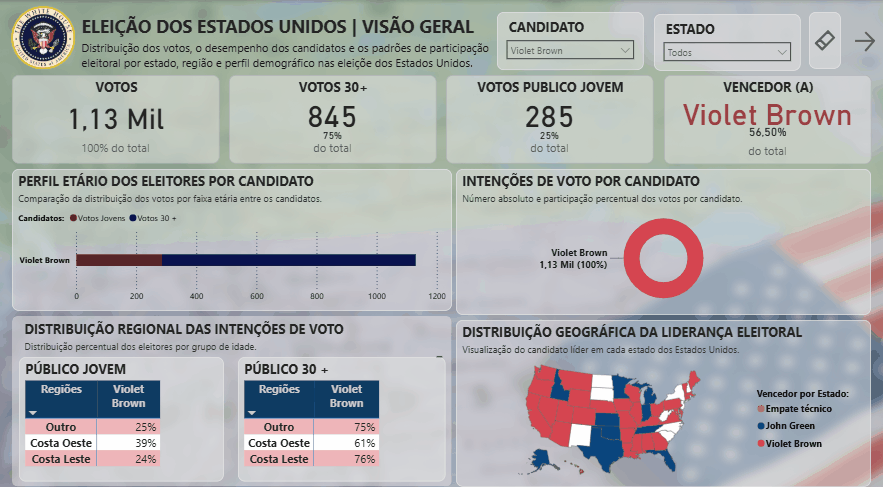

# 🗳️ Dashboard de Análise de Eleições

## 📖 Sobre o projeto

Este projeto consiste no desenvolvimento de um dashboard interativo no **Power BI** para análise de dados de pesquisas eleitorais. O objetivo é transformar dados em informações estratégicas por meio de visualizações intuitivas, permitindo acompanhar o desempenho dos candidatos e explorar diferentes perspectivas dos resultados.

Além da construção do dashboard, foram aplicadas etapas de tratamento de dados, modelagem e criação de medidas analíticas utilizando **Power Query** e **DAX**.

---

## 📷 Dashboard

<p align="center">
  
</p>

---

## 🎯 Objetivos

- Analisar os resultados das pesquisas eleitorais.
- Comparar o desempenho dos candidatos.
- Visualizar a distribuição dos votos.
- Desenvolver um dashboard intuitivo e interativo.
- Aplicar boas práticas de Business Intelligence.

---

## 🛠️ Tecnologias utilizadas

- Power BI
- Power Query
- DAX
- Microsoft Excel

---

## 📊 Indicadores apresentados

- Total de votos
- Percentual de votos por candidato
- Ranking dos candidatos
- Distribuição dos votos
- Comparativo entre candidatos

---

## ✨ Funcionalidades

- Dashboard totalmente interativo.
- Filtros dinâmicos.
- Medidas desenvolvidas em DAX.
- Tratamento e transformação dos dados no Power Query.
- Visualizações voltadas para análise rápida e tomada de decisão.

---

## 📚 Aprendizados

Durante o desenvolvimento deste projeto foram aplicados conhecimentos em:

- Modelagem de dados
- ETL com Power Query
- Criação de medidas em DAX
- Storytelling com dados
- Design de dashboards
- Boas práticas de visualização de informações

---

## 📁 Estrutura do projeto

```text
📂 Dashboard_Pesquisa_Eleitoral_PowerBI
│
├── 📄 Dashboard.pbix
├── 📄 Base_de_Dados.xlsx
├── 📄 Documentação.pdf
├── 📂 Imagens
└── 📄 README.md
```

---

## 👩‍💻 Autora

**Taynar**

Médica Veterinária em transição de carreira para a área de Dados, atualmente graduanda em Ciência de Dados. Este projeto faz parte do meu portfólio e demonstra conhecimentos em análise de dados, visualização de informações e desenvolvimento de dashboards utilizando Power BI.

---

⭐ Se este projeto foi útil ou interessante para você, deixe uma estrela no repositório!
