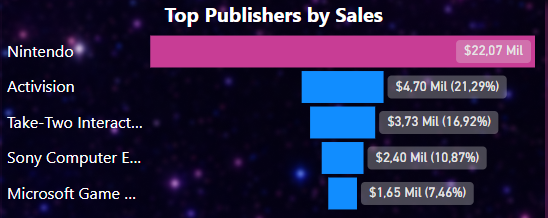
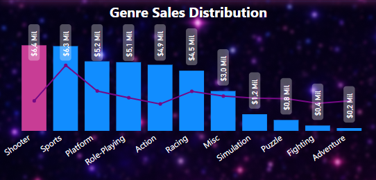
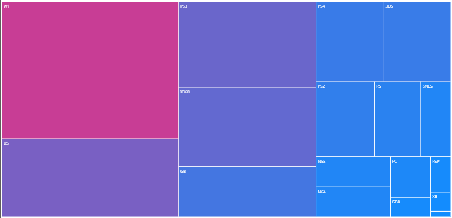

# 🎮 Video Game Sales Dashboard (Power BI)

## 📊 Project Overview

This project presents an interactive dashboard developed using **Microsoft Power BI** to analyze global video game sales.  
The goal is to explore patterns in the gaming industry by examining sales distribution across **publishers, genres, platforms, and regions**.

The dashboard allows users to identify market trends and gain insights into how different segments of the gaming industry perform worldwide.

---

## 🔎 Interactive Dashboard

You can explore the interactive dashboard below:

<iframe title="Games.v1" width="600" height="373.5" src="https://app.powerbi.com/view?r=eyJrIjoiZGExZmFjODgtN2YyYS00OGJjLWExYWQtMmI3NjQwNGU3YTZkIiwidCI6IjE0Y2JkNWE3LWVjOTQtNDZiYS1iMzE0LWNjMGZjOTcyYTE2MSIsImMiOjh9" frameborder="0" allowFullScreen="true"></iframe>

---

## 📸 Dashboard Preview

### Dashboard Overview

### KPI Indicators

### Top Platforms by Sales

### Publisher Performance

### Genre Sales Distribution

### Platform Sales Treemap

---

## 📈 Key Insights

### Publisher Analysis
- A small number of publishers dominate global video game sales.
- Large publishers show strong influence over the gaming market.
- Market concentration suggests competitive advantages for major companies.

### Regional Sales Distribution
- **North America** represents the largest share of total sales.
- **Europe** follows as the second-largest gaming market.
- Other regions contribute smaller but still relevant portions of total sales.

### Genre Performance
- **Action** and **Sports** genres appear among the most successful categories.
- Some genres maintain consistent performance across different regions.

### Platform Trends
- Certain platforms concentrate the majority of game releases.
- Platform popularity strongly influences total sales performance.

---

## 🧰 Tools Used

- Microsoft Power BI – Data visualization and dashboard development
- Power BI Data Modeling
- DAX measures for KPI and sales calculations

---

## 📂 Project Structure
´´´

video-game-sales-dashboard
│
├── dataset
│   └── video_game_sales.csv
│
├── outputs
│   ├── dashboard_overview.png
│   ├── sales_by_platform.png
│   ├── sales_by_genre.png
│   └── publisher_analysis.png
│
├── scripts
│   └── games_dashboard.pbix
│
└── README.md

´´´

### Folder Description

**dataset**  
Contains the dataset used to build the analysis.

**outputs**  
Contains exported images of the dashboard for visualization in the README.

**scripts**  
Contains the Power BI dashboard file (`.pbix`) including data model, measures, and visualizations.

---

## 🎯 Project Objectives

- Practice **data visualization and dashboard design**
- Extract **business insights from data**
- Develop **clear and user-friendly reports**
- Apply **data storytelling techniques**

---

## 💡 About the Project

This dashboard was created as part of a **data analytics learning project** focused on developing practical skills in dashboard design, data analysis, and business insight generation.
