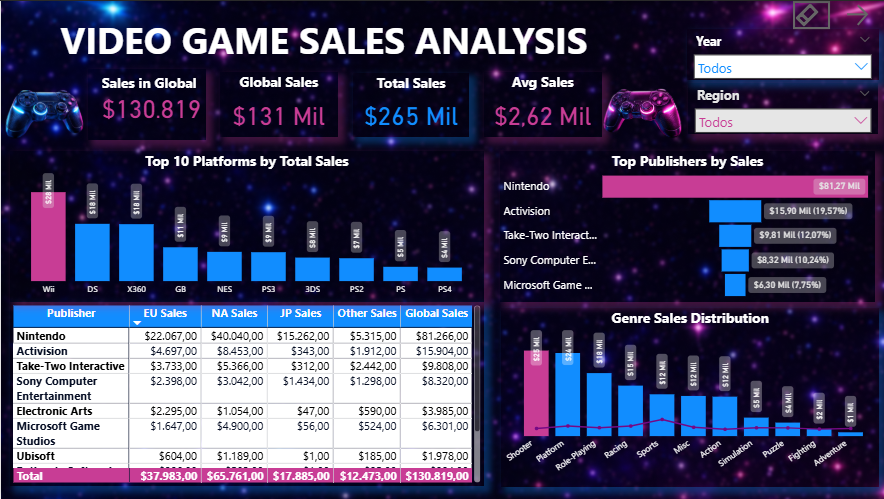
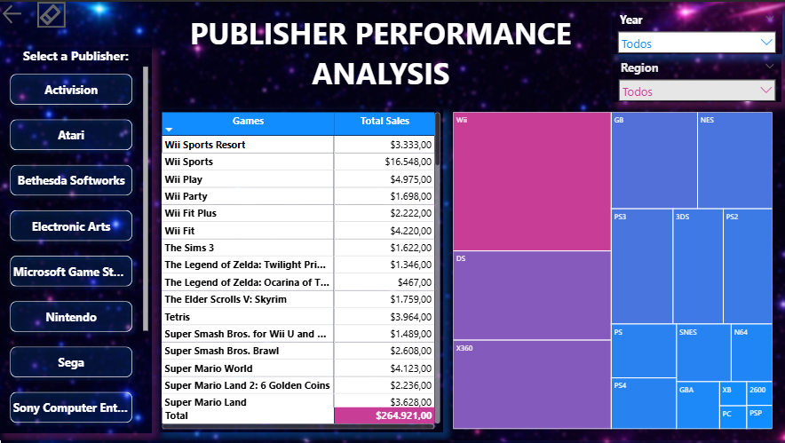
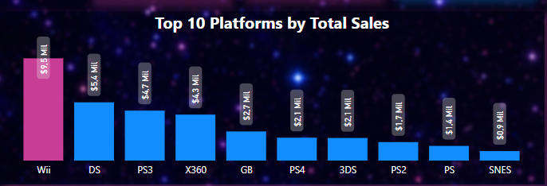

# 🎮 Dashboard de Vendas de Video Games (Power BI)

## 📊 Visão Geral do Projeto

Este projeto apresenta um dashboard interativo desenvolvido utilizando **Microsoft Power BI** para analisar as vendas globais de videogames.  
O objetivo é explorar padrões da indústria de jogos analisando a distribuição de vendas entre **publishers (distribuidoras), gêneros, plataformas e regiões**.

O dashboard permite identificar tendências de mercado e gerar insights sobre como diferentes segmentos da indústria de games se comportam globalmente.

---

## 🔎 Dashboard Interativo

Você pode explorar o dashboard interativo abaixo:

https://app.powerbi.com/view?r=eyJrIjoiZGExZmFjODgtN2YyYS00OGJjLWExYWQtMmI3NjQwNGU3YTZkIiwidCI6IjE0Y2JkNWE3LWVjOTQtNDZiYS1iMzE0LWNjMGZjOTcyYTE2MSIsImMiOjh9

---

## 📸 Visualização do Dashboard

### Visão Geral do Dashboard



### Indicadores KPI


### Top 10 Plataformas por Vendas


### Desempenho das Publishers


### Distribuição de Vendas por Gênero


### Treemap de Vendas por Plataforma


---

## 📈 Principais Insights

### Análise por Publisher
- Um pequeno número de publishers domina as vendas globais de videogames.
- Grandes empresas exercem forte influência sobre o mercado de games.
- A concentração de mercado sugere vantagens competitivas para grandes publishers.

### Distribuição Regional de Vendas
- **América do Norte** representa a maior fatia das vendas totais.
- **Europa** aparece como o segundo maior mercado de games.
- Outras regiões contribuem com uma parcela menor, mas ainda relevante, das vendas globais.

### Desempenho por Gênero
- Os gêneros **Action** e **Sports** estão entre os mais populares em termos de vendas totais.
- Alguns gêneros apresentam desempenho consistente em diferentes regiões.

### Tendências de Plataforma
- Algumas plataformas concentram a maior parte dos lançamentos de jogos.
- A popularidade da plataforma influencia diretamente o volume de vendas.

---

## 🧰 Ferramentas Utilizadas

- Microsoft Power BI – Visualização de dados e desenvolvimento do dashboard  
- Modelagem de dados no Power BI  
- Medidas em DAX para cálculo de KPIs e métricas de vendas  

---

## 📂 Estrutura do Projeto
```
video-game-sales-dashboard
│
├── dataset
│ └── video_game_sales.csv
│
├── outputs
│ ├── dashboard_overview.png
│ ├── sales_by_platform.png
│ ├── sales_by_genre.png
│ └── publisher_analysis.png
│
├── scripts
│ └── games_dashboard.pbix
│
└── README.md
```

### Descrição das Pastas

**dataset**  
Contém o conjunto de dados utilizado para construir a análise.

**outputs**  
Contém imagens exportadas do dashboard utilizadas para visualização no README.

**scripts**  
Contém o arquivo do dashboard do Power BI (`.pbix`), incluindo o modelo de dados, medidas e visualizações.

---

## 🎯 Objetivos do Projeto

- Praticar **visualização de dados e design de dashboards**
- Extrair **insights de negócio a partir de dados**
- Desenvolver **relatórios claros e fáceis de interpretar**
- Aplicar técnicas de **data storytelling**

---

## 💡 Sobre o Projeto

Este dashboard foi criado como parte de um **projeto de aprendizado em análise de dados**, com foco no desenvolvimento de habilidades práticas em design de dashboards, análise de dados e geração de insights de negócio.
